- [Getting started](#getting-started)
- [VS Code extensions](#vs-code-extensions)
- [Testing](#testing)
- [Localisation (l10n)](#localisation-l10n)
- [Generating build_runner files](#generating-build_runner-files)
- [Advanced Melos](#advanced-melos)
- [Firebase config](#firebase-config)
- [Adding a new module](#adding-a-new-module)

# Getting started

## Cloning the repo with SSH

If you have already configured your computer to use SSH for cloning GIT repos from DevOps you can skip this section.

_Windows users should replace `~/` with their `c:\Users\<username>\` folder_

Create a new key pair using:

`ssh-keygen -C "firstname.lastname@emrgroup.com"`

Open the `~/.ssh/id_rsa.pub` and copy the text

Go to https://dev.azure.com/emrtf01/_usersSettings/keys and add a new key.

Run the following command to add the repo as a known host:

`ssh-keyscan -t rsa ssh.dev.azure.com >> ~/.ssh/known_hosts`

## Starting the app for the first time

This project uses Melos to control packages and Mason to automate creation of new features.

Windows users will need to add `%USERPROFILE%\AppData\Local\Pub\Cache\bin` to the Path in Environment Variables.

(_If you have updated the Path you may also need to restart your terminal or VSCode instance to pick up that change_)

To get started install Melos using the following command:

`dart pub global activate melos`

Then install Mason using the following command:

`dart pub global activate mason_cli`

If you haven't already done so, you'll need to authorise your computer to connect to our Dart packages feed following the [instructions on our wiki page](https://dev.azure.com/emrtf01/EMR_Software/_wiki/wikis/EMR-Project-One.wiki/885/Emr-Dart-Package-Feed?anchor=connect-to-the-feed-for-pulling-packages).

You should then be able to run:

`melos fix`

in the project's root folder (where this readme is).

The packages for all sub projects will then be automatically installed, and various additional Melos tasks will be run. (You should run `melos fix` whenever you switch branches)

You can then run one of the two shell projects:
- `emr one web (dev)` using Chrome
- `emr one native (dev)` using either iOS or Android

## Working with local builds vs "Package Built" EMRApps

Using Melos means that by default EMRApps when built locally will use all the source code contained in its main monorepo. Because of this any code you change in local files will take effect locally without any extra steps. However when the code is built for deployment it will use a "package built" approach that will mean all modules must be published to our package feed for changes to have any effect.

> **NOTE:** _The DEV build of EMRApps uses the same process as local builds and therefore will not require you to publish packages in order to test them, DEV will always work from the sources in the monorepo_

Any branch you create to update a module should also contain a version update to the module's `pubspec.yaml` file. If you make a change in a PR without updating the version of your module that should be flagged during the PR review. 

For example changing the "CRM" package, before:

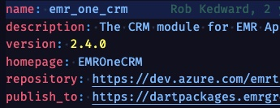

Would become:

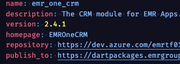

Bumping the "CRM" module version from 2.4.0 to 2.4.1 with the rest of your code changes.

Once your PR is merged you will also have to manually publish the new version of your module, you can do that easily by triggering one of the many module build pipelines available here:

> [Dart package pipelines](https://dev.azure.com/emrtf01/EMR_Software/_build?definitionScope=%5CDartPackages)

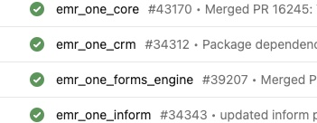

_(We will try to automate this later)_

Simply find the pipeline corresponding to your module and trigger a build (by default the build will use the `develop` branch which should contain the changes you have already had merged).

Once your package build is completed your new package is available on the feed. To make use of this the package built version of EMRApps will need to be updated to use this new version of your package. By default the package built version of EMRApps uses strict package versioning to prevent unwanted code deployments. 

In order to ensure your updated package is used you must make another PR with the version change in this repository:

> [EMRApps Repo](https://dev.azure.com/emrtf01/EMR_Software/_git/EMRApps)

Simply make a small PR branch which updates the corresponding shell `pubspec.yaml`:

|Module scope|Modify|
|-|-|
|Web only|`packages\emr_one_shell_web\pubspec.yaml`|
|Native only|`packages\emr_one_shell_native\pubspec.yaml`|
|Web & Native|`packages\emr_one_shell_web\pubspec.yaml` `packages\emr_one_shell_native\pubspec.yaml`|

Find your package reference in the `pubspec.yaml` and update it to the new version:

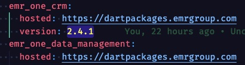

Once _this_ PR is approved and merged a new package built version of EMRApps will be deployed to the BETA environment.

## Username/password sign in on Android
To sign in using username/password on the native Android app when running in debug mode, follow these instructions:

- Navigate to the `packages/emr_one_shell_native/android` folder in a Terminal
- Make sure you have a Java runtime available (run `java --version` to verify that)
  - On a Mac, if you don't have a Java runtime, but do have Android Studio, you could run this with the appropriate path: `export JAVA_HOME=/Applications/Android\ Studio.app/Contents/jbr/Contents/Home`
- Run `./gradlew signinReport`
- Copy the SHA1 and SHA-256 lines and ask a senior developer with permissions to add the values into the Firebase Console:
  - https://console.firebase.google.com/project/emrappsdev/settings/general/android:com.emrgroup.emrone.nativeshell.dev
  - "Add fingerprint"

# VS Code extensions
A number of recommended extensions have been added to `.vscode\extensions.js` so you should be prompted to install these:
- [Flutter Coverage](https://marketplace.visualstudio.com/items?itemName=Flutterando.flutter-coverage) for viewing the code coverage per folder/file in the test view
- [Coverage Gutters](https://marketplace.visualstudio.com/items?itemName=ryanluker.vscode-coverage-gutters) to display test coverage generated by lcov
- [i18n arb editor](https://marketplace.visualstudio.com/items?itemName=innwin.i18n-arb-editor) which is a useful UI for editing localisation files (see below). _Note that i18n stands for internationalisation, however the rest of this readme refers to localisation (l10n)._

# Testing
To run all Flutter tests and generate a code coverage report first install these tools:
```
dart pub global activate coverde
dart pub global activate junitreport
```
and then run `melos test`. You'll be able to see the result in the Testing panel if you have the "Flutter Coverage" extension installed in VS Code.

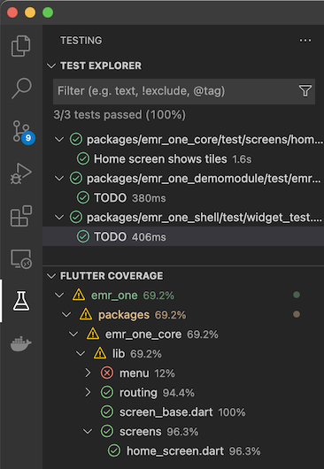

To view an HTML report run `melos coverage:report` which will launch a report in your browser:

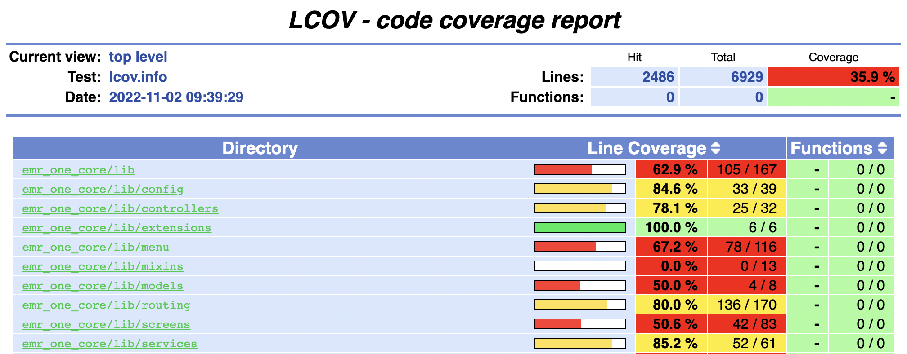

# Localisation (l10n)
Packages should support localisation. A package within this project contains a `l10n` folder which contains key/value pairs of strings for the supported locales:

`./packages/emr_one_localisations/l10n`

These can either be edited manually, but it's preferable to use the _i18n arb editor_ extension. Simply right click on the `l10n` folder (the one in the root, where this readme is - not the copies within the individual packages) and choose "i18n arb editor":

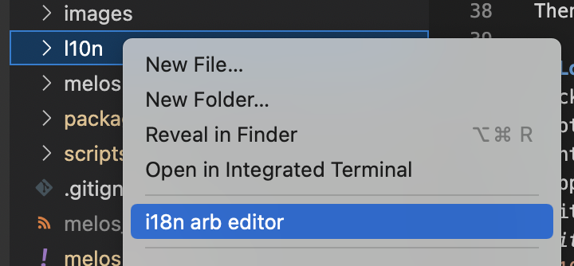

which will show the UI in either grid:

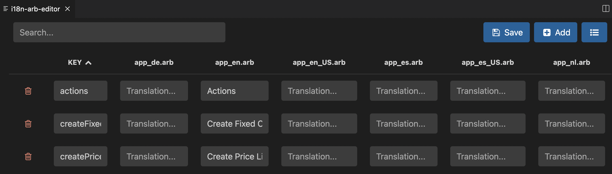

or list mode, which is probably easier to use:

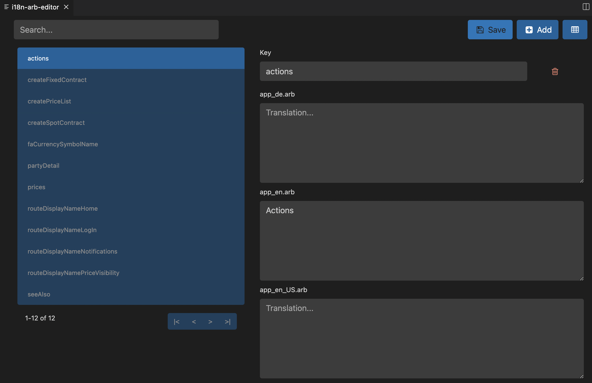

Using this tool also sorts the keys in the file alphabetically which makes it easier to identify differences in PRs.

Once the .arb files contain your keys/text, run `melos l10n` which will copy the .arb files into the `emr_one_localisation`'s `lib\l10n` folder and generate the appropriate AppLocalizations files (that end up in `.dart_tool/flutter_gen`).

As a minimum you should add a value for the `app_en.arb` and `app_zu.arb` values. The 'zu' locale is used for testing and should simply be the key surrounded by square brackets e.g. `[example]` - this makes it easier to see which text has or hasn't been localised, and for us to see which key is being used in a particular location of the screen.

You can then access localised text by using an emr_one_core extension method on `BuildContext`:

```
import 'package:emr_one_core/extensions/extensions.dart';

context.l10n.prices
```

It's also possible to use placeholders in strings:
- Add a key such as `exampleKey` with a value of e.g. `Hello {userName}`
- Add another key to specify the placeholder type e.g. `@exampleKey.placeholders.userName.type` with a dart type e.g. `String` or `int`.

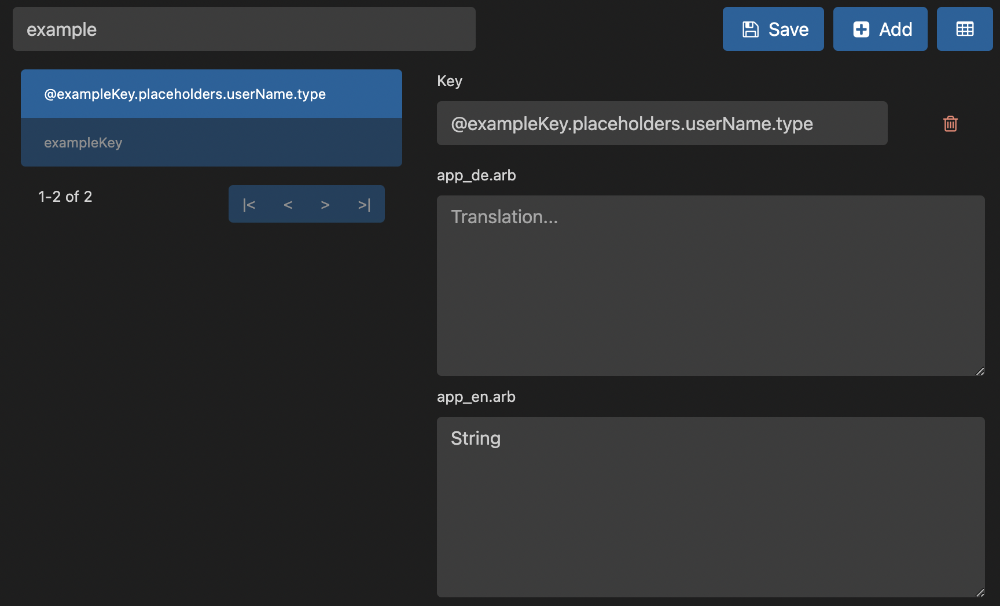

This will actually generate the following the the .arb files:
```
  "@exampleKey": {
    "placeholders": {
      "userName": {
        "type": "String"
      }
    }
  },
  "exampleKey": "Hello {userName}",
```

Then after running `melos l10n` you will be able to use `context.l10n.exampleKey('Constantine')` to display "Hello Constantine".

### Changes to localisation strings 

If you modify any localisation `.arb` files you **must** run `melos l10n` and update the `emr_one_localisations` package version:

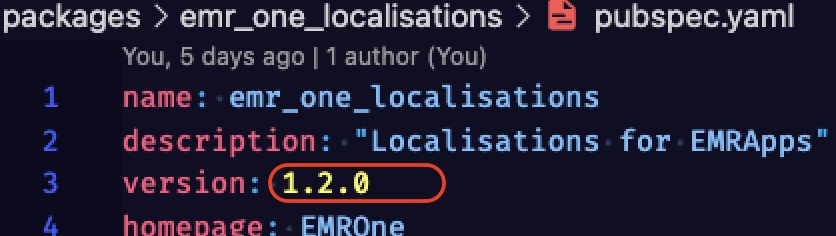

Once your PR is merged the `emr_one_localisation` pacakge build pipeline should be run to ensure it is published to the package feed. 

# Generating build_runner files
Run `melos generate` to run all dart and flutter build runners, including creating JSON and GraphQL generated files.

# Advanced Melos

To see what other melos commands are available run `melos run`

If you're interested in seeing the configuration of the Melos tasks look at `melos.yaml` in the root.

If you need a script which is really advanced, or runs differently on Mac or Windows, you can call `dart melos.dart` and run any dart code to perform the task; see `coverage:report` as an example.

# Firebase config
Install the Firebase CLI:
```
dart pub global activate flutterfire_cli
```

The shell packages contain Firebase configuration for each environment. The following commands can be run to recreate `lib/firebase_options.dart`, so you'll need to rename the `_dev` and `_beta` files appropriately if updating those. The bundle Id parameters need to be changed appropriately:
```
flutterfire configure -i com.emrgroup.emrone.nativeshell.dev -a com.emrgroup.emrone.nativeshell.dev
flutterfire configure -i com.emrgroup.emrone.nativeshell.beta -a com.emrgroup.emrone.nativeshell.beta
flutterfire configure -i com.emrgroup.emrone.nativeshell -a com.emrgroup.emrone.nativeshell
```

# Adding a new module

All the modules are currently stored in the same repo. Each can be found in the `\packages` folder.

To add a new one, use **Mason** to create a new module. Mason uses "bricks" to run a recipie that creates something new in the project. To use these bricks you first need to fetch them, first of all run:

`mason get`

_(if you have followed these instructions previously, you may need to run `mason upgrade` to fetch any changes to the bricks)_

This should pull down our 'eomodule' brick from Git. If you cannot run this command it may be because you haven't setup your Git access using SSH. To complete this step you will need to setup SSH access. 

Once that's done, we can activate the brick to generate your new module, to do this run the following command:

`mason make eomodule -o packages --on-conflict overwrite`

You will be prompted to enter a name for your module, for purposes of this example we'll use the name 'sprockets'.

> NOTE: Of course doing this for real you would use a more meaningful module name

So type *sprockets* when prompted, it should look something like this:

```
? Provide Module name sprockets
✓ Made brick eomodule (0.1s)
✓ Generated 7 file(s):
  ./packages/emr_one_sprockets/test/sprockets_test.dart (new)
  ./packages/emr_one_sprockets/l10n.yaml (new)
  ./packages/emr_one_sprockets/pubspec.yaml (new)
  ./packages/emr_one_sprockets/lib/l10n/README.md (new)
  ./packages/emr_one_sprockets/lib/routing/sprockets_route_registry.dart (new)
  ./packages/emr_one_sprockets/lib/sprockets.dart (new)
  ./packages/emr_one_sprockets/analysis_options.yaml (new)
```

Once that's done, you should see a new module in your packages folder.

_Note: There's currently an issue with the Flutter tooling, which is creating platform specific folders for a package, when they aren't needed, so if you see `android`, `ios`, `linux`, `macos` and `windows` folders, these should be deleted._

Next we want to *wire up* your new module. To do this we need to add it into the 2 SHELL packages (**emr_one_shell_native** & **emr_one_shell_web**).

To start, open:

`./packages/emr_one_shell_web/pubspec.yaml`

Add the following to the **dependencies**:

```
  sprockets:
    path: ../emr_one_sprockets
```

Now run the following:

```
melos fix

melos generate
```

which will bootstrap the apps, and generate some necessary files (which includes wiring up the routing in the shell app).

Now launch the Web Shell, you should see a new icon and page for your new module.

**Repeat** these steps for the Native shell (emr_one_shell_native).
